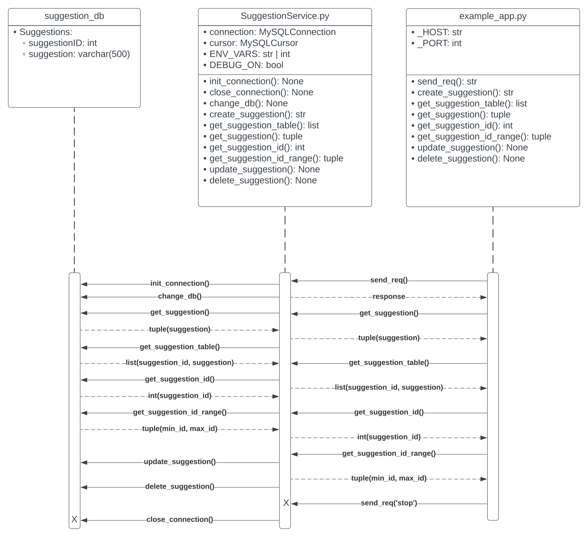
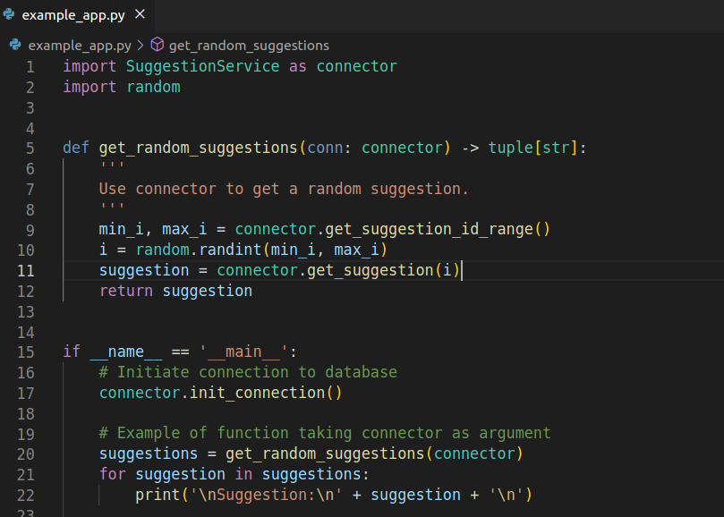
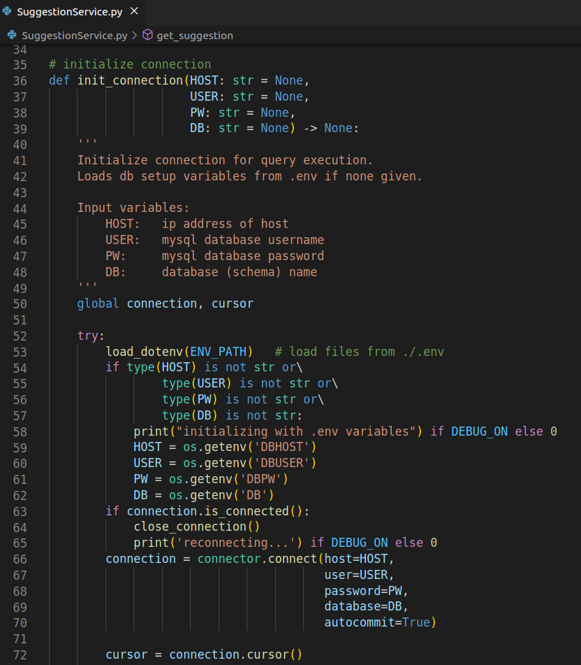
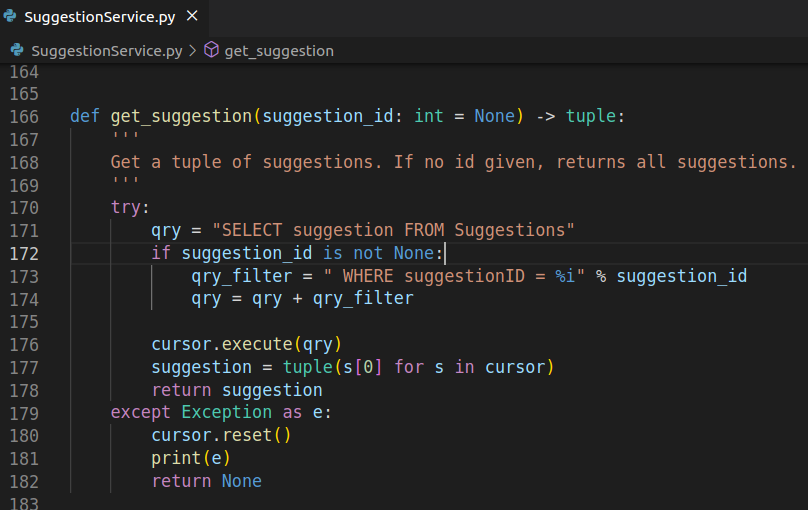

# Suggestion Data Microservice

# Overview

This is a simple database connector service designed for a random suggestion generator.

The connector will connect to a database via socket connection using the mysql python module.

The service can be imported into a python app and used to do a variety of operations.

# Getting Started

## Prerequisites

The following should be installed prior to starting this service:
- python v3.6+
- python modules:
    - `mysql`
        - Install with `pip3 install mysql-connector-python`
        - [mysql-connector documentation](https://dev.mysql.com/doc/connector-python/en/connector-python-installation-binary.html)
    - `dotenv`
        - Install with `pip3 install python-dotenv`
        - [dotenv documentation](https://pypi.org/project/python-dotenv/)
- mysql server
    - [MySQL Install guide](https://dev.mysql.com/doc/refman/8.0/en/installing.html)
    - Optional - [Guide for server setup on ubuntu](https://www.digitalocean.com/community/tutorials/how-to-install-linux-apache-mysql-php-lamp-stack-on-ubuntu-22-04)

## Using the app

1. Ensure prerequisite applications are installed in your environment.
2. Review and load the `DDL.sql` into your mysql datbase.
3. Edit the .env file to match your database login criteria.
    - Alternatively, the `init_connection()` function of `SuggestionService` can take these arguments directly.
4. Import `SuggestionService` into your app.
    - `example_app.py` shows how the connector can be used.
5. Initiate connection
6. Use service as needed for the app
7. Close connection

## Service UML

## How to request data

- To request data, first import the service to your app.
- Next, initiate a connection as shown in the example app:

- Initiating the connection will create a socket connection to your database using `mysql-connector-python`

## How to receive data

- After importing the service and initiating a connection, use the service functions to get data.
- Service functions show input datatypes, return types, and have docstrings explaining functionality:
