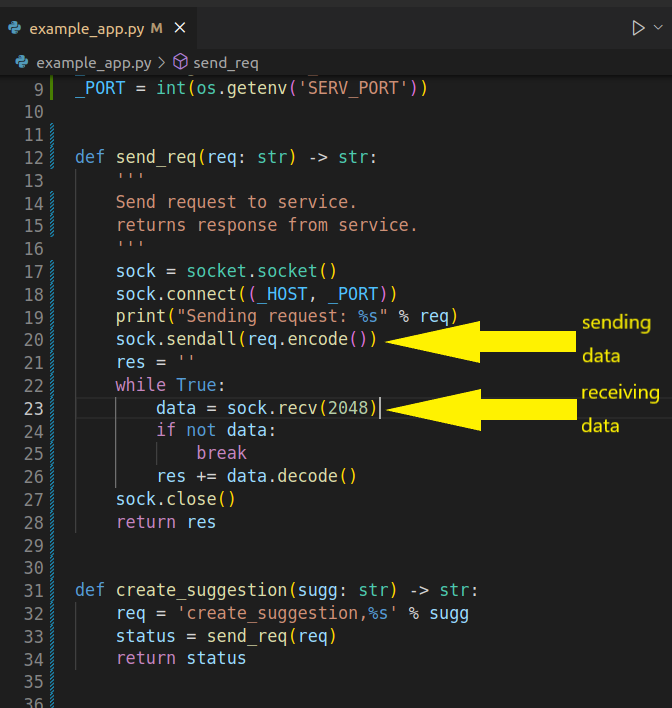

# Suggestion Data Microservice

# Overview

This is a simple database connector service designed for a random suggestion generator.

The connector will connect to a database via socket connection using the mysql python module.

The service can be imported into a python app and used to do a variety of operations.

# Getting Started

## Prerequisites

The following should be installed prior to starting this service:
- python v3.6+
- python modules:
    - `mysql`
        - Install with `pip3 install mysql-connector-python`
        - [mysql-connector documentation](https://dev.mysql.com/doc/connector-python/en/connector-python-installation-binary.html)
    - `dotenv`
        - Install with `pip3 install python-dotenv`
        - [dotenv documentation](https://pypi.org/project/python-dotenv/)
- mysql server
    - [MySQL Install guide](https://dev.mysql.com/doc/refman/8.0/en/installing.html)
    - Optional - [Guide for server setup on ubuntu](https://www.digitalocean.com/community/tutorials/how-to-install-linux-apache-mysql-php-lamp-stack-on-ubuntu-22-04)

## Using the app

1. Ensure prerequisite applications are installed in your environment.
2. Review and load the `DDL.sql` into your mysql datbase.
3. Edit the .env file to match your database login criteria.
4. Start Suggestion Service by running `python3 SuggestionService.py`
5. Run your app and make calls to the service via socket connection. See `example_app.py` for basic implementation.
6. Send `stop` to the Suggestion Service from your app to close all connections.

## Service UML

## How to send and request data

- Send data using the `socket` function: `socket.sendall()` as shown in figure1
- Request data by passing the service function name through the socket.
    - Service functions are under "Suggestions TABLE CRUD OPERATIONS" in `SuggestionService.py`
    - The request string is parsed by the `get_response()` in `SuggestionService.py` and calls the matching service function.

figure1

